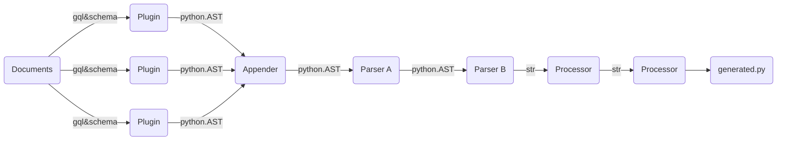

Turm uses a modular design to ensure a wide range of applications of graphql
codegeneration. This means that you can freely choose to add and alter some 
behaviour of the code generation library. This is done with the help of plugins, parsers and processors:

Turms loads or introspects your schema, parses your configuration and loads the
plugins sequentially, causing them to generate their part of the python AST,
concats these together, pipes them to parsers to manipulate the ast.Tree and unparsers
this to a codestring that can then be processed by processors (like black or isort or merge),
and are then written to file.

If you wish to enforce a specific naming style (like snakecasing, pascal case gql)
you can do so by specifying stylers. Plugins will then try to resolve a field or classname
according to this style.