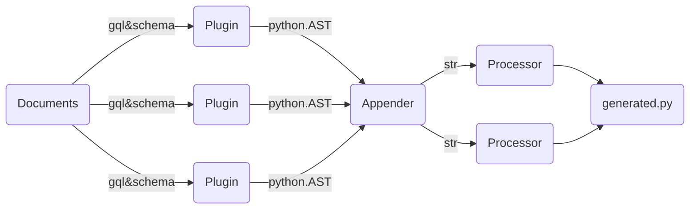

# Plugins

Plugins are the heart of turms. They are generating the actual
python AST (Abstract Syntax Tree), that will be used for code generation.

They closely work with stylers to ensure your favourite code style gets respected.

## Generation

Plugins are called sequentially and the output will be appended to the global ast.Tree,
Plugins can also register imports and register references to their generated code for
following plugins to find (check ClassRegistry)
