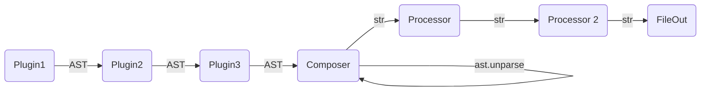

# Processors

Processors sit at the end of the generaiton pipeline

They are the entrypoint for linters, import sorting and application
of code styles.

## Included Processors

Turms comes included with two processors that rely on external dependencies:

- **Black** Applys the black codestyle
- **ISort** Sort the imports according to isort
