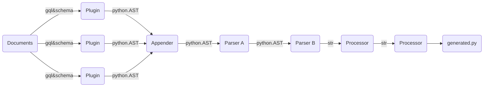

# Quick Start

Let's discover **Turms in less than 5 minutes**.

### Goal

Turms is a `graphql-codegen` inspired code generator for python that generates typed and serializable python code from your graphql schema and documents. Just define your query in standard graphql syntax and let turms create fully typed queries/mutation and subscriptions, that you can use in your favourite IDE.

### Installation

```bash
pip install turms
```

turms is a pure development library and will not introduce any dependency on itself into your
code, so we recommend installing turms as a development dependency.

```bash
poetry add -D turms

```

:::tip
As of now turms only supports python 3.9 and higher (as we rely on ast unparsing)
:::

### Configuration

Turms relies on and complies with [graphql-config](https://www.graphql-config.com/docs/user/user-introduction) and searches your current working dir for the graphql-config file.

```yaml
projects:
  default:
    schema: http://api.spacex.land/graphql/
    documents: graphql/**.graphql
    extensions:
      turms: # path for configuration for turms
        out_dir: examples/api
        plugins: # path for plugin configuration
          - type: turms.plugins.enums.EnumsPlugin
          - type: turms.plugins.inputs.InputsPlugin
          - type: turms.plugins.fragments.FragmentsPlugin
          - type: turms.plugins.operation.OperationsPlugin
          - type: turms.plugins.funcs.OperationsFuncPlugin
        processors:
          - type: turms.processor.black.BlackProcessor
          - type: turms.processor.isort.IsortProcessor
        scalar_definitions:
          uuid: str
          timestamptz: str
          Date: str
```

:::tip
Each plugin as its own scope of configuration, that you can consult
::::

## Generation

```bash
turms gen
```

Will generate python code according to the schema and your documents.

### Design

Turm uses a modular design to ensure a wide range of applications of graphql
codegeneration. This means that you can freely choose to add and alter some 
behaviour of the code generation library. This is done with the help of plugins, parsers and processors:



Turms loads or introspects your schema, parses your configuration and loads the
plugins sequentially, causing them to generate their part of the python AST,
concats these together, pipes them to parsers to manipulate the ast.Tree and unparsers
this to a codestring that can then be processed by processors (like black or isort or merge),
and are then written to file.

If you wish to enforce a specific naming style (like snakecasing, pascal case gql)
you can do so by specifying stylers. Plugins will then try to resolve a field or classname
according to this style.
