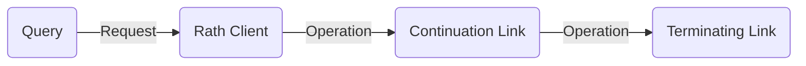
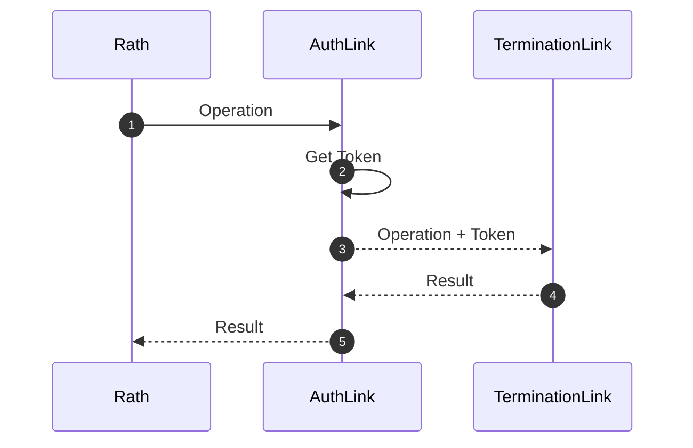
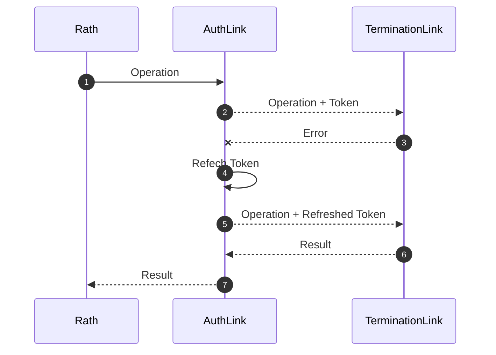

# Design

Rath is structured around links and their orchestration

### Terminating Links

Terminating Links make network requests to the underlying graphql
endpoint.

### Continuation Links

Continuation Links take requests in form of operations and
alter the request or introduce logic before a underlying request to
the endpoint.

As an example an Auth link

The authlink can then on further store the auth token and append it to
the operation.
They can also handle complex failures

